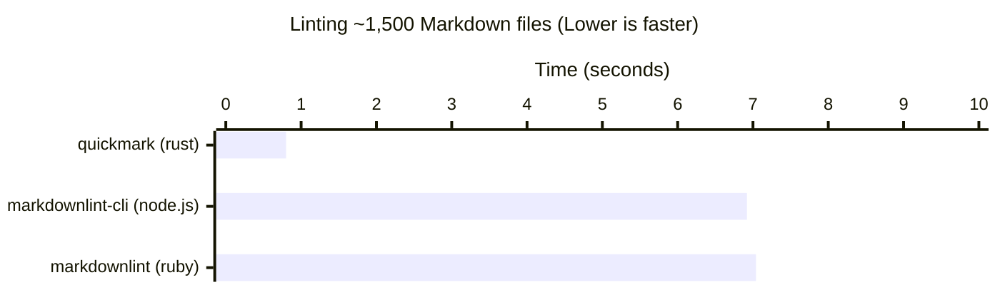

# QuickMark

[](https://github.com/ekropotin/quickmark/blob/main/LICENSE)

[](https://crates.io/crates/quickmark-core)
[](https://crates.io/crates/quickmark-cli)
[](https://crates.io/crates/quickmark-server)

[](https://marketplace.visualstudio.com/items?itemName=ekropotin.vscode-quickmark)
[](https://plugins.jetbrains.com/plugin/28305-quickmark)

Quickmark is a Markdown/[CommonMark](https://commonmark.org/) linter written in Rust with first-class LSP support, giving you fast, seamless feedback in any editor.

QuickMark is not just another Markdown linter; it's a tool designed with the modern developer in mind. By prioritizing speed and integrating seamlessly with your development environment, QuickMark enhances your productivity and makes Markdown linting an effortless part of your workflow.

This project takes a lot of inspiration from David Anson's [markdownlint](https://github.com/DavidAnson/markdownlint). Our goal is to match its supported rules and behavior as closely as possible. When a rule is ambiguous or its behavior isn’t explicitly defined, we rely on the following specifications as the ultimate sources of truth:

- [CommonMark](https://spec.commonmark.org/current/)
- [GitHub Flavored Markdown Spec](https://github.github.com/gfm/)

## AI Disclaimer

Quickmark is designed, architected, and primarily written by a human. AI tools (e.g., Claude) were used to speed up routine tasks — such as drafting documentation, refining commit messages, scaffolding GitHub Actions, or generating test boilerplate.

All design decisions, core implementation, and linter logic are written and maintained by real people. Think of the AI as an assistant for the repetitive parts, not as the author of the project.

## Key features

- ⚡️ **Rust-Powered Speed**: Leveraging the power of Rust, QuickMark offers exceptional performance, making linting operations swift and efficient, even for large Markdown files.
- 🧵 **Parallel Processing**: Process multiple files simultaneously, dramatically reducing lint times for large projects.
- 🔎 **Smart File Discovery**: Automatically discover markdown files using glob patterns, directory traversal, and intelligent filtering.
- ⚙️ **LSP Integration**: QuickMark integrates effortlessly with your favorite code editors through LSP, providing real-time feedback and linting suggestions directly within your editor.
- 🧩 **Customizable Rules**: Tailor the linting rules to fit your project's specific needs, ensuring that your Markdown files adhere to your preferred style and standards.

## Demo


## Benchmarks



This benchmark was conducted on a MacBook Pro (2021, M1 Max)
using [hyperfine](https://github.com/sharkdp/hyperfine)
with [GitLab documentation](https://gitlab.com/gitlab-org/gitlab/-/tree/7d6a4025a0346f1f50d2825c85742e5a27b39a8b/doc)
as the dataset.

## Getting Started

### Quickmark CLI

#### Installation

##### Option 1 - from Brew (OSX only)

```shell
brew tap ekropotin/tap
brew install quickmark-cli

```

##### Option 2 - from crates

```shell
cargo install quickmark-cli
```

##### Option 3 - download from the release page

[release page](https://github.com/ekropotin/quickmark/releases)

##### Option 4 - build from sources

```shell
git clone git@github.com:ekropotin/quickmark.git
cd quickmark
cargo build --release
```

This command will generate the `qmark` binary in the `./target/release` directory.

### Usage

QuickMark supports multiple ways to specify files for linting:

**Lint a single file:**

```shell
qmark /path/to/file.md
```

**Lint multiple files:**

```shell
qmark file1.md file2.md file3.md
```

**Lint all markdown files in current directory:**

```shell
qmark
# Or explicitly:
qmark .
```

**Lint all markdown files in a directory:**

```shell
qmark /path/to/docs/
```

**Lint files using glob patterns:**

```shell
# All .md files in current directory
qmark *.md

# All .md files recursively in docs/ directory
qmark "docs/**/*.md"

# Multiple patterns
qmark "src/**/*.md" "tests/**/*.markdown"
```

**Supported file extensions:**

- `.md`
- `.markdown`
- `.mdown`
- `.mkd`
- `.mkdn`

QuickMark automatically:

- Discovers markdown files recursively when given directories
- Ignores non-markdown files and respects `.gitignore` patterns
- Processes files in parallel for maximum performance
- Uses hierarchical configuration discovery for each file

### IDE integrations

#### VSCode-base editors (VsCode, Cursor, Windsurf, etc)

Install the extension from the [VSCode marketplace](https://marketplace.visualstudio.com/items?itemName=ekropotin.vscode-quickmark)

#### NeoVIM

Install via cargo:

```bash
cargo install quickmark-server
```

Or download the binary for your platform from the latest [release page](https://github.com/ekropotin/quickmark/releases)

Configure with [nvim-lspconfig](https://github.com/neovim/nvim-lspconfig):

```lua
local lspconfig = require("lspconfig")
local configs = require("lspconfig.configs")

if not configs.quickmark then
    configs.quickmark = {
        default_config = {
            -- in case of cargo install the path is $HOME/.cargo/bin
            cmd = { "<path_to_quickmark_server>" },
            filetypes = { "markdown" },
            root_dir = lspconfig.util.root_pattern("quickmark.toml", ".git"),
            settings = {},
            single_file_support = true,
        },
    }
end
lspconfig.quickmark.setup({})
```

#### Jetbrains IDEs

Install from the [Marketplace](https://plugins.jetbrains.com/plugin/28305-quickmark/)

**Note**: Only paid versions of IDEs are supported (like Idea Ultimate) at the moment. This may change in the future.

### Configuration

QuickMark uses a sophisticated hierarchical configuration discovery system that automatically finds the most appropriate configuration for any given file:

#### Configuration Discovery Order

1. **Environment Variable**: If `QUICKMARK_CONFIG` environment variable is set, it uses the config file at the specified path
2. **Hierarchical Discovery**: If not found, QuickMark searches upward from the target file's location for `quickmark.toml` files
3. **Default**: If no configuration is found, [default configuration](#default-configuration) is used

#### Hierarchical Configuration Discovery

QuickMark automatically discovers configuration files by searching upward from the target markdown file's directory, stopping at repository boundaries. This enables different parts of your project to have their own linting rules while maintaining a sensible inheritance hierarchy.

**Search Process:**

- Starts from the directory containing the target markdown file
- Searches upward through parent directories for `quickmark.toml` files
- Uses the first configuration file found
- Stops searching when it encounters boundary markers

**Boundary Markers** (search stops at these):

- **IDE Workspace Roots**: Configured workspace directories (LSP integration only)
- **Git Repository Root**: Directories containing `.git`
- **Current Working Directory**: For CLI usage (prevents searching beyond the directory where you ran the command)

**Example Hierarchical Structure:**

```
my-project/
├── .git/                       # Git repository boundary (search stops here)
├── quickmark.toml              # Project-wide config (relaxed rules)
├── Cargo.toml                  # Regular project file (ignored during config search)
├── README.md                   # Uses project-wide config
├── src/
│   ├── quickmark.toml          # Stricter rules for source code
│   ├── api.md                  # Uses src/ config
│   └── docs/
│       └── guide.md            # Inherits src/ config (stricter)
├── tests/
│   └── integration.md          # Uses project-wide config (relaxed)
└── vendor/
    └── external-lib/
        ├── .git/               # Another git boundary (search stops here)
        └── README.md           # Uses default config (no inheritance from parent)
```

In this example:

- `src/api.md` and `src/docs/guide.md` use the stricter `src/quickmark.toml` configuration
- `README.md` and `tests/integration.md` use the relaxed project-wide `quickmark.toml` configuration
- `vendor/external-lib/README.md` uses the default configuration because the search stops at the `.git` boundary
- Only `.git` directories act as boundaries - other project markers like `Cargo.toml` are ignored

#### Using QUICKMARK_CONFIG Environment Variable

You can specify a custom configuration file location using the `QUICKMARK_CONFIG` environment variable:

```shell
# Set config file path
export QUICKMARK_CONFIG="/path/to/your/custom-config.toml"
qmark file.md

# Or use it inline
QUICKMARK_CONFIG="/path/to/custom-config.toml" qmark file.md
```

This is especially useful for:

- Shared configurations across multiple projects
- CI/CD pipelines with centralized configs
- Different config files for different environments

#### Default configuration

```toml
[linters.severity]
# possible values are: 'warn', 'err' and 'off'
default = 'err'
heading-increment = 'err'
heading-style = 'err'
ul-style = 'err'
list-indent = 'err'
ul-indent = 'err'
no-trailing-spaces = 'err'
no-hard-tabs = 'err'
no-reversed-links = 'err'
no-multiple-blanks = 'err'
line-length = 'err'
commands-show-output = 'err'
no-missing-space-atx = 'err'
no-multiple-space-atx = 'err'
no-missing-space-closed-atx = 'err'
no-multiple-space-closed-atx = 'err'
blanks-around-headings = 'err'
heading-start-left = 'err'
no-duplicate-heading = 'err'
single-h1 = 'err'
no-trailing-punctuation = 'err'
no-multiple-space-blockquote = 'err'
no-blanks-blockquote = 'err'
ol-prefix = 'err'
list-marker-space = 'err'
blanks-around-fences = 'err'
blanks-around-lists = 'err'
no-inline-html = 'err'
no-bare-urls = 'err'
hr-style = 'err'
no-emphasis-as-heading = 'err'
no-space-in-emphasis = 'err'
no-space-in-code = 'err'
no-space-in-links = 'err'
fenced-code-language = 'err'
first-line-heading = 'err'
no-empty-links = 'err'
proper-names = 'err'
required-headings = 'err'
no-alt-text = 'err'
code-block-style = 'err'
single-trailing-newline = 'err'
code-fence-style = 'err'
emphasis-style = 'err'
strong-style = 'err'
link-fragments = 'err'
reference-links-images = 'err'
link-image-reference-definitions = 'err'
link-image-style = 'err'
table-pipe-style = 'err'
table-column-count = 'err'
blanks-around-tables = 'err'
descriptive-link-text = 'err'

# see a specific rule's doc for details of configuration
[linters.settings.heading-style]
style = 'consistent'

[linters.settings.ul-style]
style = 'consistent'

[linters.settings.ol-prefix]
style = 'one_or_ordered'

[linters.settings.ul-indent]
indent = 2
start_indent = 2
start_indented = false

[linters.settings.line-length]
line_length = 80
code_blocks = true
headings = true
tables = true
strict = false
stern = false

[linters.settings.blanks-around-headings]
lines_above = [1]
lines_below = [1]

[linters.settings.blanks-around-fences]
list_items = true

[linters.settings.no-duplicate-heading]
siblings_only = false
allow_different_nesting = false

[linters.settings.single-h1]
level = 1
front_matter_title = '^\s*title\s*[:=]'

[linters.settings.first-line-heading]
allow_preamble = false
front_matter_title = '^\s*title\s*[:=]'
level = 1

[linters.settings.no-trailing-punctuation]
punctuation = '.,;:!。，；：！'

[linters.settings.link-fragments]
ignore_case = false
ignored_pattern = ""

[linters.settings.reference-links-images]
shortcut_syntax = false
ignored_labels = ["x"]

[linters.settings.required-headings]
headings = []
match_case = false

[linters.settings.link-image-reference-definitions]
ignored_definitions = ["//"]

[linters.settings.no-inline-html]
allowed_elements = []

[linters.settings.proper-names]
names = []
code_blocks = true
html_elements = true

[linters.settings.fenced-code-language]
allowed_languages = []
language_only = false

[linters.settings.code-block-style]
style = 'consistent'

[linters.settings.code-fence-style]
style = 'consistent'

[linters.settings.table-pipe-style]
style = 'consistent'

[linters.settings.no-trailing-spaces]
br_spaces = 2
list_item_empty_lines = false
strict = false

[linters.settings.no-hard-tabs]
code_blocks = true
ignore_code_languages = []
spaces_per_tab = 1

[linters.settings.no-multiple-blanks]
maximum = 1

[linters.settings.list-marker-space]
ul_single = 1
ol_single = 1
ul_multi = 1
ol_multi = 1

[linters.settings.hr-style]
style = 'consistent'

[linters.settings.no-emphasis-as-heading]
punctuation = '.,;:!?。，；：！？'

[linters.settings.emphasis-style]
style = 'consistent'

[linters.settings.strong-style]
style = 'consistent'

[linters.settings.link-image-style]
autolink = true
inline = true
full = true
collapsed = true
shortcut = true
url_inline = true

[linters.settings.descriptive-link-text]
prohibited_texts = ["click here", "here", "link", "more"]
```

#### Using Default Severity

The `default` severity setting allows you to set a baseline severity for all rules, then override specific rules as needed. This is inspired by markdownlint's configuration approach and makes it easier to manage large rule sets.

**Example: Set all rules to warning level, with specific overrides:**

```toml
[linters.severity]
default = "warn"              # All rules default to warning
heading-style = "err"         # Override: make heading style an error
ul-style = "off"              # Override: disable unordered list style checks
line-length = "err"           # Override: make line length an error

[linters.settings.heading-style]
style = "atx"

[linters.settings.line-length]
line_length = 120
```

**Example: Disable all rules by default, enable only specific ones:**

```toml
[linters.severity]
default = "off"               # All rules disabled by default
heading-style = "err"         # Enable: heading style as error
line-length = "warn"          # Enable: line length as warning
no-hard-tabs = "err"          # Enable: hard tabs as error

[linters.settings.heading-style]
style = "atx"
```

If no `default` is specified, rules without explicit configuration use `"err"` (error) severity.

## Rules

- **[MD001](docs/rules/md001.md)** *heading-increment* - Heading levels should only increment by one level at a time
- **[MD003](docs/rules/md003.md)** *heading-style* - Consistent heading styles
- **[MD004](docs/rules/md004.md)** *ul-style* - Unordered list style consistency
- **[MD005](docs/rules/md005.md)** *list-indent* - Inconsistent indentation for list items at the same level
- **[MD007](docs/rules/md007.md)** *ul-indent* - Unordered list indentation consistency
- **[MD009](docs/rules/md009.md)** *no-trailing-spaces* - Trailing spaces at end of lines
- **[MD010](docs/rules/md010.md)** *no-hard-tabs* - Hard tabs should not be used
- **[MD011](docs/rules/md011.md)** *no-reversed-links* - Reversed link syntax
- **[MD012](docs/rules/md012.md)** *no-multiple-blanks* - Multiple consecutive blank lines
- **[MD013](docs/rules/md013.md)** *line-length* - Line length
- **[MD014](docs/rules/md014.md)** *commands-show-output* - Dollar signs before shell commands
- **[MD018](docs/rules/md018.md)** *no-missing-space-atx* - Space after hash in ATX headings
- **[MD019](docs/rules/md019.md)** *no-multiple-space-atx* - Multiple spaces after hash in ATX headings
- **[MD020](docs/rules/md020.md)** *no-missing-space-closed-atx* - Space inside closed ATX headings
- **[MD021](docs/rules/md021.md)** *no-multiple-space-closed-atx* - Multiple spaces in closed ATX headings
- **[MD022](docs/rules/md022.md)** *blanks-around-headings* - Headings surrounded by blank lines
- **[MD023](docs/rules/md023.md)** *heading-start-left* - Headings must start at the beginning of the line
- **[MD024](docs/rules/md024.md)** *no-duplicate-heading* - Multiple headings with same content
- **[MD025](docs/rules/md025.md)** *single-title*/*single-h1* - Multiple top-level headings
- **[MD026](docs/rules/md026.md)** *no-trailing-punctuation* - Trailing punctuation in headings
- **[MD027](docs/rules/md027.md)** *no-multiple-space-blockquote* - Multiple spaces after blockquote symbol
- **[MD028](docs/rules/md028.md)** *no-blanks-blockquote* - Blank line inside blockquote
- **[MD029](docs/rules/md029.md)** *ol-prefix* - Ordered list item prefix consistency
- **[MD030](docs/rules/md030.md)** *list-marker-space* - Spaces after list markers
- **[MD031](docs/rules/md031.md)** *blanks-around-fences* - Fenced code blocks surrounded by blank lines
- **[MD032](docs/rules/md032.md)** *blanks-around-lists* - Lists surrounded by blank lines
- **[MD033](docs/rules/md033.md)** *no-inline-html* - Inline HTML usage
- **[MD034](docs/rules/md034.md)** *no-bare-urls* - Bare URLs without proper formatting
- **[MD035](docs/rules/md035.md)** *hr-style* - Horizontal rule style consistency
- **[MD036](docs/rules/md036.md)** *no-emphasis-as-heading* - Emphasis used instead of heading
- **[MD037](docs/rules/md037.md)** *no-space-in-emphasis* - Spaces inside emphasis markers
- **[MD038](docs/rules/md038.md)** *no-space-in-code* - Spaces inside code span elements
- **[MD039](docs/rules/md039.md)** *no-space-in-links* - Spaces inside link text
- **[MD040](docs/rules/md040.md)** *fenced-code-language* - Language specified for fenced code blocks
- **[MD041](docs/rules/md041.md)** *first-line-heading*/*first-line-h1* - First line should be top-level heading
- **[MD042](docs/rules/md042.md)** *no-empty-links* - Empty links
- **[MD043](docs/rules/md043.md)** *required-headings* - Required heading structure
- **[MD044](docs/rules/md044.md)** *proper-names* - Proper names with correct capitalization
- **[MD045](docs/rules/md045.md)** *no-alt-text* - Images should have alternate text
- **[MD046](docs/rules/md046.md)** *code-block-style* - Code block style consistency
- **[MD047](docs/rules/md047.md)** *single-trailing-newline* - Files should end with a single newline
- **[MD048](docs/rules/md048.md)** *code-fence-style* - Code fence style consistency
- **[MD049](docs/rules/md049.md)** *emphasis-style* - Emphasis style consistency
- **[MD050](docs/rules/md050.md)** *strong-style* - Strong style
- **[MD051](docs/rules/md051.md)** *link-fragments* - Link fragments should be valid
- **[MD052](docs/rules/md052.md)** *reference-links-images* - Reference links should be defined
- **[MD053](docs/rules/md053.md)** *link-image-reference-definitions* - Reference definitions should be needed
- **[MD054](docs/rules/MD054.md)** *link-image-style* - Link and image style
- **[MD055](docs/rules/md055.md)** *table-pipe-style* - Table pipe style
- **[MD056](docs/rules/md056.md)** *table-column-count* - Table column count
- **[MD058](docs/rules/md058.md)** *blanks-around-tables* - Tables should be surrounded by blank lines
- **[MD059](docs/rules/md059.md)** *descriptive-link-text* - Link text should be descriptive
- **[MD060](docs/rules/md060.md)** *table-column-style* - Table column style
